# 03 — Database Server with MariaDB and phpMyAdmin


Deployment of an enterprise database server on Ubuntu Server 22.04 in VirtualBox. The project covers the installation and configuration of MariaDB, Apache and phpMyAdmin, the design of a relational database for the multi-site company from the previous networking projects, SQL queries with JOINs, and an automated backup system using cron.

---

## Table of Contents

- [Infrastructure](#infrastructure)
- [Installed services](#installed-services)
- [Database](#database)
- [Configuration](#configuration)
- [SQL Queries](#sql-queries)
- [Automated backup](#automated-backup)
- [Troubleshooting](#troubleshooting)

---

## Infrastructure

| Parameter | Value |
|---|---|
| Hypervisor | Oracle VirtualBox |
| Operating system | Ubuntu Server 22.04 LTS |
| RAM | 2048 MB |
| Disk | 20 GB VDI |
| Adapter 1 | NAT (internet access) |
| Adapter 2 | Host-Only — 192.168.56.10/24 (SSH and phpMyAdmin access) |
| Remote access | SSH from Windows Terminal |

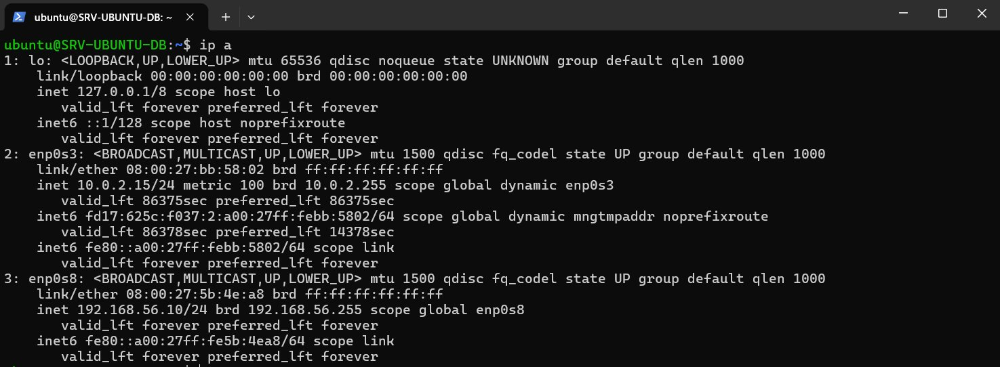

---

## Installed services

| Service | Version | Port |
|---|---|---|
| MariaDB | 10.11.14 | 3306 |
| Apache | 2.4.58 | 80 |
| PHP | 8.3.6 | — |
| phpMyAdmin | 5.2.1 | 80 |

### MariaDB running

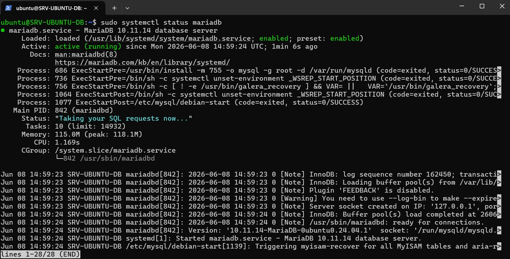

### Apache running

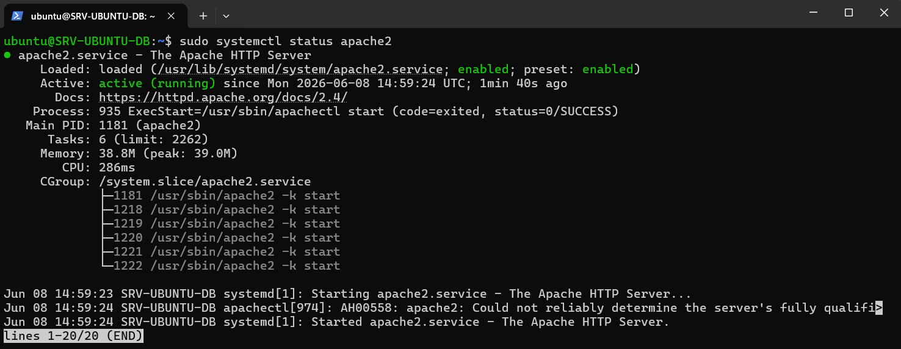

### phpMyAdmin — Login

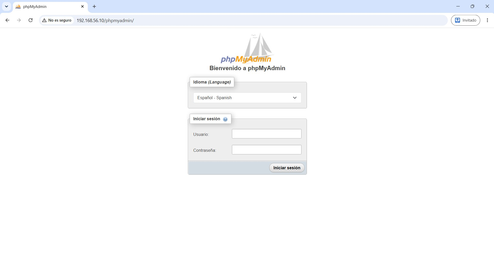

### phpMyAdmin — Main panel

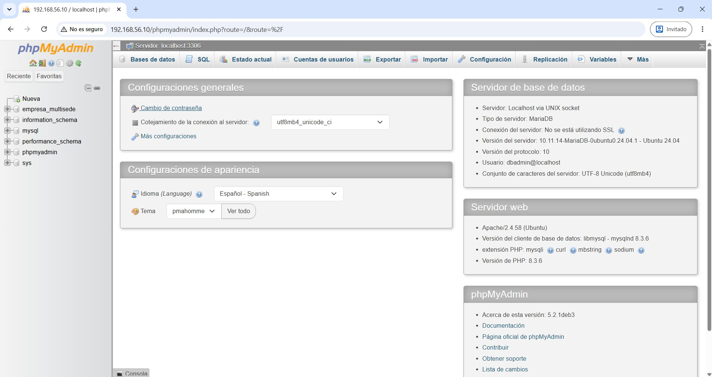

---

## Database

The `empresa_multisede` database models the infrastructure of the company with 3 sites (Madrid, Barcelona and Valencia) from the previous networking projects.

### Table diagram

```
sedes                    departamentos
─────────────            ─────────────────
id_sede (PK)             id_departamento (PK)
nombre                   nombre
ciudad                   descripcion
direccion
telefono
    │                          │
    └──────────┬───────────────┘
               │
          empleados
          ──────────────────
          id_empleado (PK)
          nombre
          apellidos
          email
          telefono
          cargo
          salario
          fecha_alta
          id_sede (FK)
          id_departamento (FK)
               │
          equipos
          ──────────────────
          id_equipo (PK)
          tipo
          marca
          modelo
          numero_serie
          estado (activo/baja/reparacion)
          id_sede (FK)
          id_empleado (FK)
```

### Database structure in phpMyAdmin

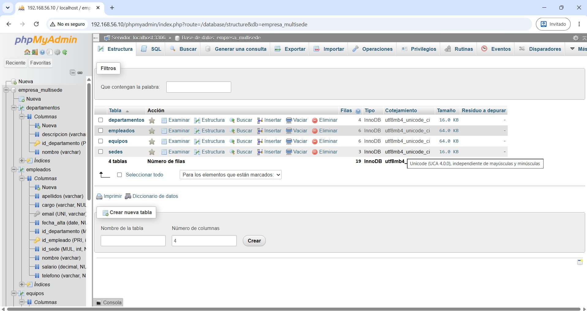

### Employees table

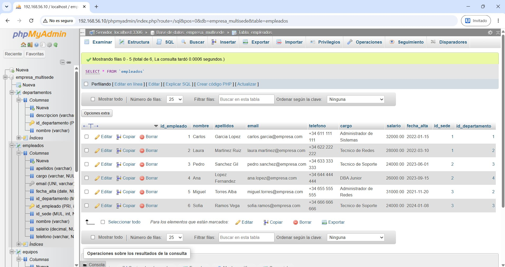

---

## Configuration

### 1. Network — static Host-Only interface

```yaml
# /etc/netplan/50-cloud-init.yaml
network:
  version: 2
  ethernets:
    enp0s3:
      dhcp4: true
    enp0s8:
      dhcp4: false
      addresses:
        - 192.168.56.10/24
```

```bash
sudo netplan apply
```

### 2. Service installation

```bash
sudo apt update && sudo apt upgrade -y
sudo apt install -y mariadb-server
sudo apt install -y apache2
sudo apt install -y phpmyadmin
sudo apt install -y libapache2-mod-php8.3
sudo a2enmod php8.3
sudo systemctl restart apache2
```

### 3. MariaDB security

```bash
sudo mysql_secure_installation
```

```
Switch to unix_socket authentication: n
Change the root password:             y
Remove anonymous users:               y
Disallow root login remotely:         y
Remove test database:                 y
Reload privilege tables:              y
```

### 4. Admin user

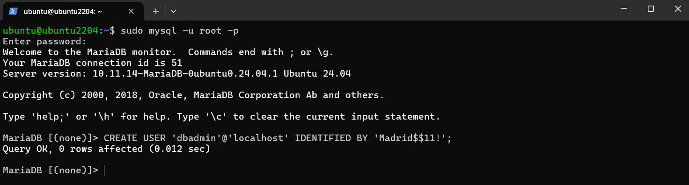

```sql
CREATE USER 'dbadmin'@'localhost' IDENTIFIED BY 'YourPassword';
GRANT ALL PRIVILEGES ON *.* TO 'dbadmin'@'localhost' WITH GRANT OPTION;
FLUSH PRIVILEGES;
```

### 5. Database creation

```sql
CREATE DATABASE empresa_multisede CHARACTER SET utf8mb4 COLLATE utf8mb4_unicode_ci;
USE empresa_multisede;

CREATE TABLE sedes (
    id_sede INT AUTO_INCREMENT PRIMARY KEY,
    nombre VARCHAR(50) NOT NULL,
    ciudad VARCHAR(50) NOT NULL,
    direccion VARCHAR(100),
    telefono VARCHAR(20)
);

CREATE TABLE departamentos (
    id_departamento INT AUTO_INCREMENT PRIMARY KEY,
    nombre VARCHAR(50) NOT NULL,
    descripcion VARCHAR(100)
);

CREATE TABLE empleados (
    id_empleado INT AUTO_INCREMENT PRIMARY KEY,
    nombre VARCHAR(50) NOT NULL,
    apellidos VARCHAR(100) NOT NULL,
    email VARCHAR(100) UNIQUE NOT NULL,
    telefono VARCHAR(20),
    cargo VARCHAR(50),
    salario DECIMAL(8,2),
    fecha_alta DATE,
    id_sede INT,
    id_departamento INT,
    FOREIGN KEY (id_sede) REFERENCES sedes(id_sede),
    FOREIGN KEY (id_departamento) REFERENCES departamentos(id_departamento)
);

CREATE TABLE equipos (
    id_equipo INT AUTO_INCREMENT PRIMARY KEY,
    tipo VARCHAR(50) NOT NULL,
    marca VARCHAR(50),
    modelo VARCHAR(50),
    numero_serie VARCHAR(100) UNIQUE,
    estado ENUM('activo','baja','reparacion') DEFAULT 'activo',
    id_sede INT,
    id_empleado INT,
    FOREIGN KEY (id_sede) REFERENCES sedes(id_sede),
    FOREIGN KEY (id_empleado) REFERENCES empleados(id_empleado)
);
```

---

## SQL Queries

### Query 1 — Employees with site and department (multiple JOIN)

```sql
SELECT e.nombre, e.apellidos, e.cargo, s.ciudad, d.nombre AS departamento
FROM empleados e
JOIN sedes s ON e.id_sede = s.id_sede
JOIN departamentos d ON e.id_departamento = d.id_departamento;
```

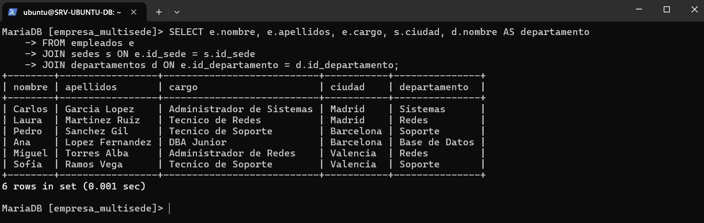

---

### Query 2 — Average salary per site (GROUP BY + AVG)

```sql
SELECT s.ciudad, COUNT(e.id_empleado) AS total_empleados,
ROUND(AVG(e.salario), 2) AS salario_medio
FROM sedes s
LEFT JOIN empleados e ON s.id_sede = e.id_sede
GROUP BY s.ciudad;
```

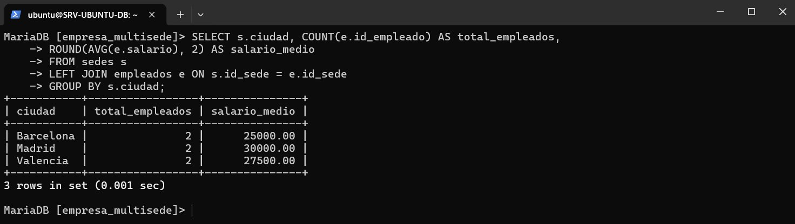

---

### Query 3 — Equipment assigned per employee (LEFT JOIN)

```sql
SELECT e.nombre, e.apellidos, eq.tipo, eq.marca, eq.modelo, eq.estado
FROM empleados e
LEFT JOIN equipos eq ON e.id_empleado = eq.id_empleado
ORDER BY e.nombre;
```

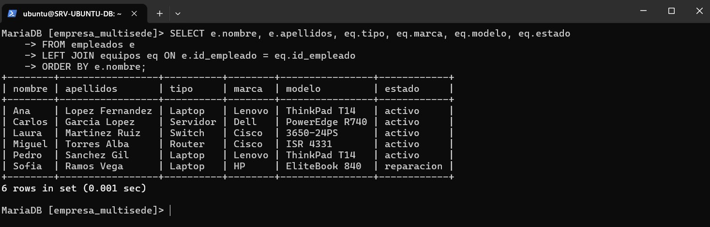

---

## Automated backup

### Compressed backup script

```bash
#!/bin/bash
DATE=$(date +%Y%m%d_%H%M%S)
mysqldump -u dbadmin -pYourPassword empresa_multisede | gzip > ~/backups/backup_$DATE.sql.gz
echo "Backup completed: backup_$DATE.sql.gz"
```

### Cron job — runs daily at 2:00 AM

```bash
0 2 * * * /home/daniel/backup_db.sh
```

### Restore a backup

```bash
gunzip < ~/backups/backup_DATE.sql.gz | mysql -u dbadmin -p empresa_multisede
```

---

## Troubleshooting

**Issue:** Host-Only interface (enp0s8) was not coming up on boot.
**Root cause:** It was not configured in netplan.
**Fix:** Added enp0s8 with static IP 192.168.56.10/24 in `/etc/netplan/50-cloud-init.yaml` and ran `sudo netplan apply`.

---

**Issue:** phpMyAdmin was displaying raw PHP code instead of the web interface.
**Root cause:** The PHP 8.3 module was not enabled in Apache.
**Fix:** Installed `libapache2-mod-php8.3`, enabled it with `a2enmod php8.3` and added `AddType application/x-httpd-php .php` to the phpMyAdmin Apache configuration.

---

*Lab built on Ubuntu Server 22.04 LTS — Daniel Moisés Loyo Vásquez*
